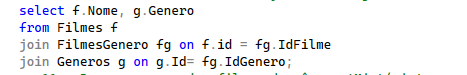

# 🎬 Consultas SQL — Filmes, Gêneros e Atores
## 📖 Sobre o projeto

Este projeto contém exercícios práticos de SQL utilizando um banco de dados fictício de filmes, gêneros e atores, com o objetivo de reforçar conceitos fundamentais de banco de dados relacionais.

As consultas foram desenvolvidas como parte dos meus estudos em Banco de Dados no curso de Técnico em Desenvolvimento de Sistemas, complementando minha formação em desenvolvimento back-end.

## 🚀 Conceitos praticados

### Neste repositório foram aplicados:

SELECT

WHERE

BETWEEN

ORDER BY

GROUP BY

COUNT

INNER JOIN

Relacionamentos entre tabelas

Filtros com operadores lógicos

## 🧠 Exemplos de consultas

Buscar filmes com duração entre 100 e 150 minutos:

Buscar filmes e seus gêneros usando relacionamento entre tabelas:

## 🛠 Tecnologias

SQL

SQL Server / MySQL

Git

GitHub

## 🎯 Objetivo do repositório

Consolidar conhecimentos de consultas SQL e modelagem relacional, habilidades essenciais para desenvolvimento back-end e construção de APIs com banco de dados.

Este repositório faz parte da minha evolução como desenvolvedor.

## 👨‍💻 Autor

João Matheus
Estudante de Técnico em Desenvolvimento de Sistemas
Foco em Back-end .NET
